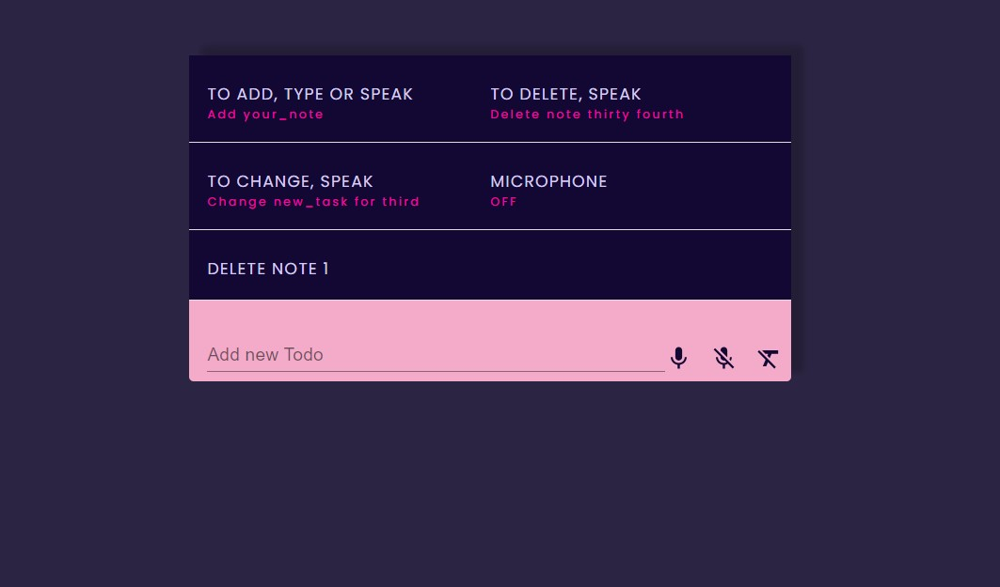

## Speech Todos App

<b>Built with</b> 

- This app allows users to create and manage their daily tasks through voice commands.
- Users can record or manually type out tasks.
- Voice recognition is done using a react library,<b>react-speech-recognition<b>.

<h2><a href="https://anushkabahuguna.github.io/speech-todos-app/">Demo</a></h2>

